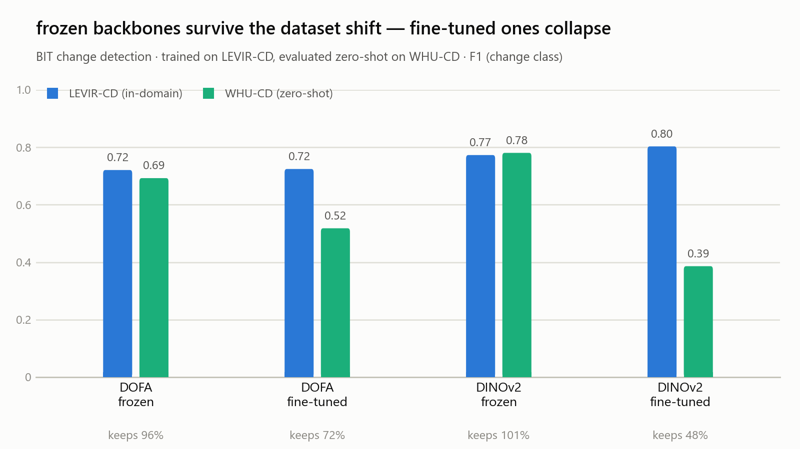
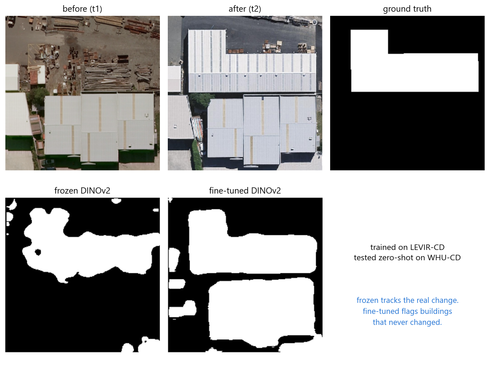

# BIT-CD Foundation-Model Backbone Comparison

Short research summary of my BIT-CD extension work for satellite change detection.

## What this experiment tests

The task is **bitemporal satellite change detection**: given two satellite images of the same
location at different times, predict a pixel-level mask of what changed.

I started from BIT-CD, a transformer-based change-detection model, then swapped its original
ImageNet ResNet image backbone for two vision foundation-model backbones:

- **DOFA** - an Earth-observation foundation model pretrained on remote-sensing imagery.
- **DINOv2** - a general-purpose vision foundation model pretrained on large-scale natural images.

The goal was to test whether foundation-model features improve cross-dataset generalization:

> If a model is trained on one geography/dataset, how well does it transfer to a completely
> different satellite dataset without retraining?

## Setup

| Item | Details |
|---|---|
| Base model | BIT-CD / Bitemporal Image Transformer |
| In-domain dataset | LEVIR-CD building change dataset |
| Zero-shot dataset | WHU-CD building change dataset |
| Task | Pixel-level changed / unchanged segmentation |
| Metric shown | F1 for the change class (`F1_1`) |
| Main comparison | Frozen vs fine-tuned DOFA and DINOv2 backbones |

The original BIT-CD reproduction reached **0.9027 F1** on LEVIR-CD, matching the published model
closely enough to use as a baseline.

## Backbone swap

BIT expects its image encoder to output a spatial feature map. DOFA and DINOv2 are ViTs, so they
output patch tokens instead of CNN feature maps.

I added small adapters that reshape foundation-model patch tokens into BIT-compatible spatial
features:

- DINOv2: `16 x 16 x 768` patch-token grid -> `32 x 64 x 64` feature map.
- DOFA: `14 x 14 x 768` patch-token grid -> `32 x 64 x 64` feature map.

The rest of BIT's bitemporal transformer/change head stays the same.

## Results

`keeps` means:

```text
WHU F1 / LEVIR F1
```

It is a quick robustness ratio under cross-dataset shift.

| Model | LEVIR F1 | WHU F1 | Keeps | WHU Precision / Recall |
|---|---:|---:|---:|---|
| DOFA frozen | 0.7208 | 0.6926 | 96.1% | P0.789 / R0.617 |
| DOFA fine-tuned | 0.7244 | 0.5181 | 71.5% | P0.741 / R0.398 |
| DINOv2 frozen | **0.7729** | **0.7805** | **101.0%** | P0.877 / R0.703 |
| DINOv2 fine-tuned | 0.8031 | 0.3862 | 48.1% | P0.266 / R0.704 |



## Main takeaway

The strongest cross-dataset result came from **frozen DINOv2**.

Fine-tuning improved DINOv2's in-domain LEVIR score, but badly hurt WHU transfer. The failure mode
was precision collapse: the fine-tuned DINOv2 model started over-flagging change on the unseen WHU
dataset.

The failure is visible directly in the predicted masks. On this WHU test scene, a new warehouse roof
appears between t1 and t2. Frozen DINOv2 tracks that change and stays quiet elsewhere; the fine-tuned
model flags the new roof *and* an entire block of buildings that never changed.



The practical lesson:

> For imagery that varies across year, geography, sensor, resolution, lighting, and season, frozen
> foundation-model features may be more robust than aggressively fine-tuned features.

Notably, EO-specific pretraining (DOFA) gave no advantage over general-purpose pretraining (DINOv2)
here — on both datasets, frozen-vs-frozen, DINOv2 was ahead. The axis that mattered was
frozen-vs-fine-tuned, not EO-vs-general.

## Caveats

This is research-grade evidence, not a benchmark.

- One dataset pair only: LEVIR-CD -> WHU-CD.
- Single seed.
- The adapter is intentionally simple (a 1x1 conv plus bilinear upsampling from the ViT patch grid to
  BIT's 64x64 feature map), which caps absolute in-domain performance — hence ~0.77 F1 frozen against
  the ResNet baseline's 0.90.
- DINOv2's 16x16 patch grid is finer than DOFA's 14x14, a small resolution confound in the
  general-vs-EO comparison.
- The claim is about cross-dataset robustness, not in-domain state-of-the-art performance.

The frozen-beats-fine-tuned direction is consistent with prior work on fine-tuning distorting
pretrained features under distribution shift (Kumar et al., ICLR 2022); the contribution here is a
controlled demonstration in the change-detection setting, plus the finding that EO-specific
pretraining buys nothing over general features.
